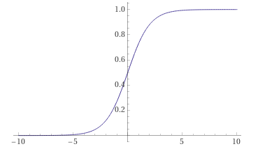

# Understanding and Using Activation Functions

Activation functions are a crucial component of neural networks. They introduce non-linearities to our model, enabling it to learn complex patterns. 
PyTorch provides a variety of activation functions you can use in our models.

## Import Necessary Libraries
```python
import torch
import torch.nn as nn
import torch.nn.functional as F
```

## Understanding Basic Activation Functions
Here are some of the common activation functions:

### ReLU (Rectified Linear Unit): 


This is the most commonly used activation function. It returns the input for all positive values of input, and returns 0 for all negative values of input.

```python
relu = nn.ReLU()
x = torch.tensor([-1.0, 1.0, 0.0])
output = relu(x)
print(output)  # Returns tensor([0., 1., 0.])
```

### Sigmoid: 

This activation function squashes the input to a range between 0 and 1. It is often used in the output layer of a binary classification problem.



```python
sigmoid = nn.Sigmoid()
x = torch.tensor([-1.0, 1.0, 0.0])
output = sigmoid(x)
print(output)  # Returns tensor([0.2689, 0.7311, 0.5000])
```

### Tanh (Hyperbolic Tangent): 


This activation function squashes the input to a range between -1 and 1.

```python
tanh = nn.Tanh()
x = torch.tensor([-1.0, 1.0, 0.0])
output = tanh(x)
print(output)  # Returns tensor([-0.7616,  0.7616,  0.0000])
```

### Using Activation Functions in a Neural Network
In a neural network, these activation functions are usually applied after linear transformations. Here's an example of a simple network with a ReLU activation:

```python
class Net(nn.Module):
    def __init__(self):
        super(Net, self).__init__()
        self.fc1 = nn.Linear(10, 20)
        self.fc2 = nn.Linear(20, 1)

    def forward(self, x):
        x = F.relu(self.fc1(x))
        x = self.fc2(x)
        return x

net = Net()
```

In this network, we apply a ReLU activation function after the first linear layer. Note that we didn't have to create an instance of nn.ReLU. 
Instead, we used the F.relu function from torch.nn.functional, which is a stateless version of the same function.

And that's it! We now understand what activation functions are, how they're used in PyTorch, and how to include them in your own neural networks.
