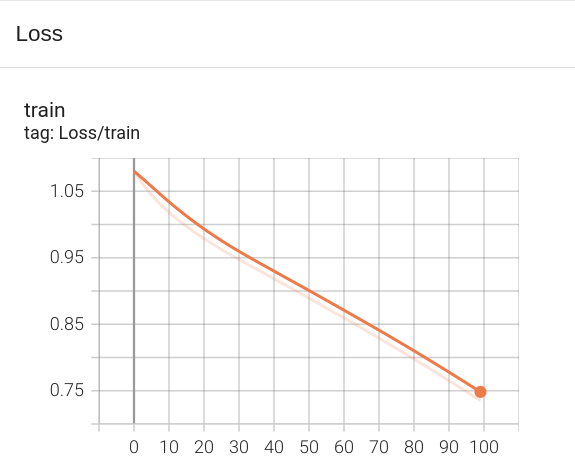

# Visualizing PyTorch Models, Data, and Training with TensorBoard

TensorBoard is a visualization toolkit for machine learning experimentation. TensorBoard allows tracking and visualizing metrics such as loss and accuracy, visualizing the model graph, viewing histograms, 
displaying images, and much more. In this tutorial, we will learn how to use TensorBoard with PyTorch.

## Install TensorBoard
First, make sure that TensorBoard is installed. If not, you can install it with pip:

```bash
pip install tensorboard
```

## Define a Simple Network
We'll define a basic network for this example.

```python
import torch
import torch.nn as nn
import torch.nn.functional as F
import torch.optim as optim
from torch.utils.tensorboard import SummaryWriter

class Net(nn.Module):
    def __init__(self):
        super(Net, self).__init__()
        self.fc1 = nn.Linear(10, 20)
        self.fc2 = nn.Linear(20, 1)

    def forward(self, x):
        x = F.relu(self.fc1(x))
        x = self.fc2(x)
        return x

net = Net()
```

## Create a SummaryWriter
The SummaryWriter is your main entry to log data for consumption by TensorBoard.

```python
writer = SummaryWriter('runs/experiment_1')
```

## Writing to TensorBoard
Now let's write a random input and the corresponding model graph to TensorBoard.

```python
# Random input tensor
input_tensor = torch.rand(10, 10)

# Writing the model graph
writer.add_graph(net, input_tensor)
```

This will log the graph of the model and allow us to visualize it in TensorBoard.

## Running TensorBoard
To start TensorBoard and see the visualizations, we can run the following command in the terminal:

```bash
tensorboard --logdir=runs
```

Then, open your web browser and go to `localhost:6006`. You should see the TensorBoard interface, where you can navigate to the "Graphs" tab to see the architecture of your model line below:


## Logging Training Metrics
Let's assume we have a simple training loop and we want to log the training loss. Here's an example:

```python
# Create a random target tensor
target = torch.randn(10, 1)

# Define a loss function and an optimizer
criterion = nn.MSELoss()
optimizer = optim.SGD(net.parameters(), lr=0.01)

for epoch in range(100):  # loop over the dataset multiple times
    # zero the parameter gradients
    optimizer.zero_grad()

    # forward + backward + optimize
    output = net(input_tensor)
    loss = criterion(output, target)
    loss.backward()
    optimizer.step()

    # Write loss into the writer
    writer.add_scalar('Loss/train', loss, epoch)

print('Finished Training')

# Closing the writer
writer.close()
```

In this example, we log the training loss at each epoch during training. After running this code, you can refresh TensorBoard, and you should see a "Scalars" tab where the training loss is plotted against the epoch number:


There's much more you can do with TensorBoard, such as visualizing image data, creating embeddings, and more. Check out the TensorBoard documentation for more details
