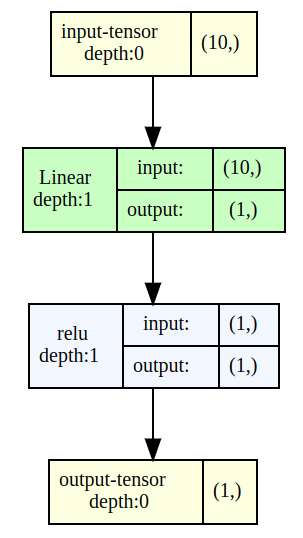

# Visualizing a neural network

Working with neural networks can often be simplified if we visualize the network. This process aids in understanding the structure and functionality of the neural network, 
providing a clear overview of how information flows and is processed.

In addition to enhancing our comprehension, visual representations also offer valuable insights for optimizing the network, identifying potential bottlenecks, 
and troubleshooting any issues that might arise. So, let's embark on this journey of defining and creating an instance of our neural network for a more concrete and visual understanding.

To accomplish this, we first need to define our network and create an instance of it.

``` python
import torch
import torch.nn as nn

class SimpleNet(nn.Module):
    def __init__(self, input_size, output_size):
        super(SimpleNet, self).__init__()
        self.layer1 = nn.Linear(input_size, output_size)
        
    def forward(self, x):
        x = self.layer1(x)
        x = torch.relu(x)
        return x

net = SimpleNet(10, 1)
```

Now let us visualize the `net` using `torchview` package:

```
from torchview import draw_graph

model_graph = draw_graph(net, input_size=(10,), expand_nested=True)
model_graph.visual_graph
```
Note than we are supplying `input_size` which is `10` for our current network. We should have a network visual graph like below:



